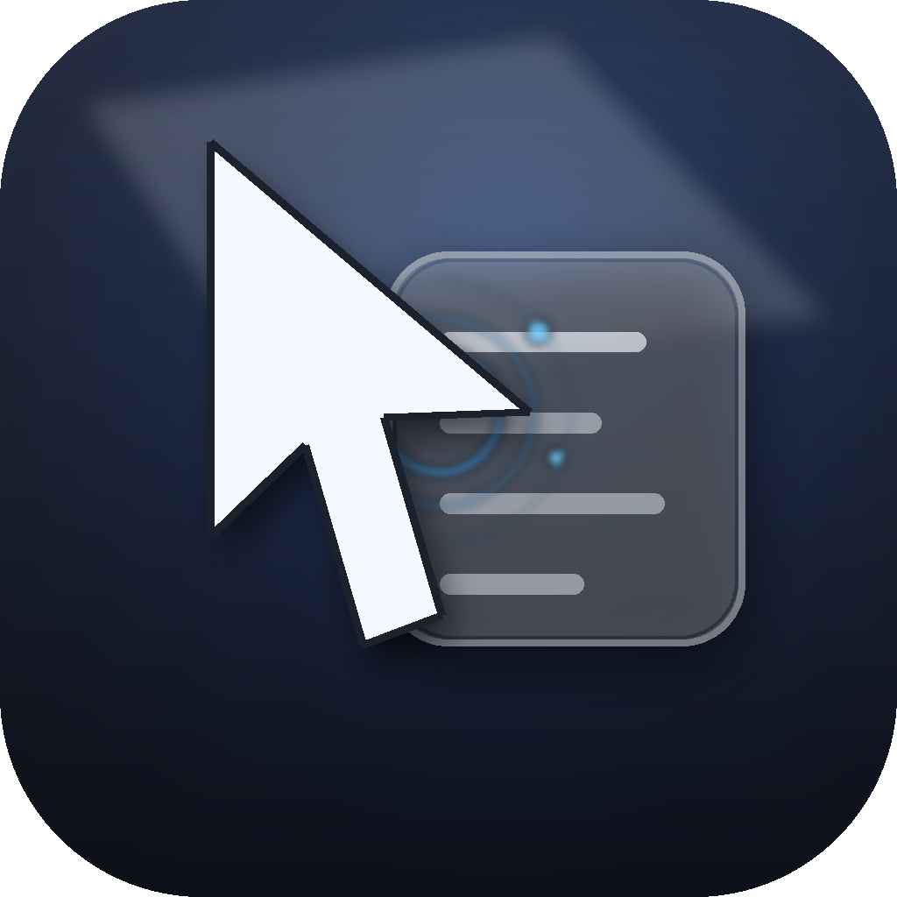

<p align="center">
  
</p>

<h1 align="center">Super RClick</h1>

<p align="center">
  macOS Finder 右键增强工具 · Supercharge your Finder right-click menu
</p>

<p align="center">
  <a href="#功能特性">中文</a> · <a href="#features">English</a>
</p>

---

## 功能特性

**Super RClick** 是一款专为 macOS 设计的 Finder 右键菜单增强工具，让你的文件操作更高效、更优雅。

### 🗂️ 文件操作
- **复制路径** — 一键复制完整路径、POSIX 路径、Shell 转义路径
- **在终端打开** — 直接在当前文件夹下打开终端
- **压缩文件** — 快速压缩选中的文件和文件夹
- **新建文件** — 支持创建 `.txt`、`.md`、`.py`、`.json`、`.html`、`.csv` 等多种格式

### ✏️ 批量重命名
- 支持**前缀**、**后缀**、**替换**三种重命名模式
- 智能编号功能，可设置起始值、步进和补零
- 实时预览重命名结果，带冲突检测
- 支持从 Finder 右键直接触发，也可从菜单栏手动选择文件

### 🖼️ 图片转换
- 支持 **PNG / JPEG / WEBP / TIFF / HEIC** 五种格式互转
- Finder 右键子菜单一键选择目标格式
- 转换后的文件保存到原目录

### ⚙️ 自定义与设置
- 自定义动作可见性 — 按需显示/隐藏菜单项
- 工作空间管理 — 监控和管理多个工作目录
- 双语界面 — 完整支持中文和英文
- 状态栏常驻 — 作为后台工具常驻运行，也可选择在 Dock 显示

---

## Features

**Super RClick** is a powerful Finder context menu extension for macOS that supercharges your file operations.

### 🗂️ File Operations
- **Copy Path** — Copy full path, POSIX path, or shell-escaped path
- **Open Terminal Here** — Open terminal directly in any folder
- **Compress Items** — Quick archive selected files & folders
- **New File** — Create `.txt`, `.md`, `.py`, `.json`, `.html`, `.csv` and more

### ✏️ Batch Rename
- Three rename modes: **prefix**, **suffix**, **replace**
- Smart numbering with customizable start, step, and zero-padding
- Real-time preview with conflict detection
- Triggered via Finder right-click or manually select files from menu bar

### 🖼️ Image Conversion
- Convert between **PNG / JPEG / WEBP / TIFF / HEIC**
- One-click format selection via Finder submenu
- Output saved to original directory

### ⚙️ Customization & Settings
- Toggle action visibility — show/hide menu items as needed
- Workspace management — monitor and manage multiple directories
- Bilingual UI — full Chinese and English support
- Menu bar resident — runs as a background utility, optionally shown in Dock

---

## 安装 · Installation

### 方式一：直接下载（推荐）

前往 [Releases](../../releases) 下载最新的 `.dmg` 文件，打开后将应用拖入"应用程序"文件夹即可。

### 方式二：从源码构建

```bash
git clone https://github.com/haoqiqin/SuperRClick.git
cd SuperRClick
open SuperRClick.xcodeproj
```

用 Xcode 编译运行即可。

---

## 系统要求 · Requirements

- **macOS 15.0 (Sequoia)** 及以上
- 需要在「系统设置 → 隐私与安全性 → 扩展 → Finder 扩展」中启用 Super RClick

---

## 截图 · Screenshots

> *Coming soon*

---

## 许可 · License

[MIT License](LICENSE)

---

<p align="center">
  Made with ❤️ by <a href="https://github.com/haoqiqin">@haoqiqin</a>
</p>
