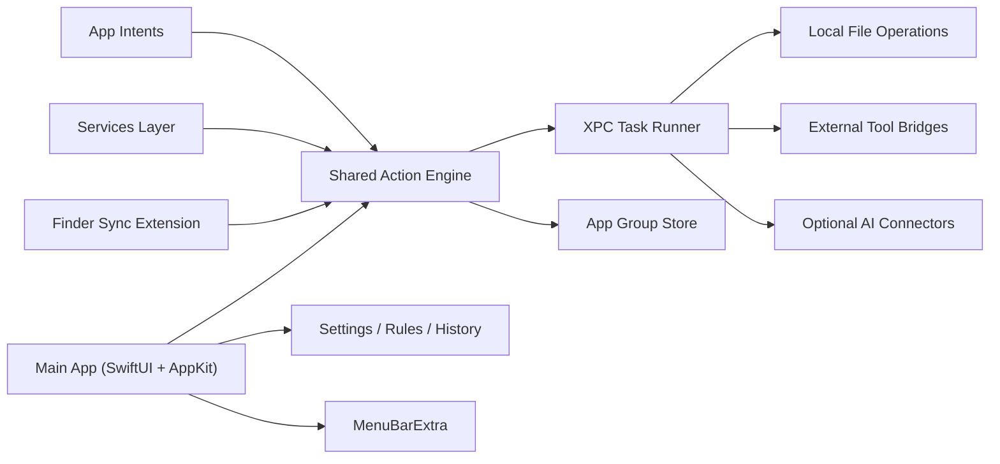

# Super RClick Implementation Plan

> **For Claude:** REQUIRED SUB-SKILL: Use superpowers:executing-plans to implement this plan task-by-task.

**Goal:** Build a native macOS 26+ right-click assistant that feels system-embedded, restores Windows-like file and text productivity workflows where Apple allows, and expands into a full-featured context action platform over time.

**Architecture:** Use a hybrid SwiftUI + AppKit main app with multiple Apple-approved entry points instead of attempting unsupported global menu replacement. The first release centers on Finder context actions, menu bar control, and selected-text/file Services, backed by a shared app group container, a shared action engine, and extension-safe XPC boundaries.

**Tech Stack:** Swift 6, SwiftUI, AppKit, Finder Sync extension, Services, App Intents, MenuBarExtra, NSXPCConnection, SQLite/Core Data in App Group container, Swift Testing/XCTest, Apple code signing/notarization.

---

## 1. Product Definition

### Product name

`Super RClick`

### One-sentence positioning

An Apple-native context assistant for macOS that makes right-click workflows faster, richer, and more customizable for files, folders, selected text, and power-user actions.

### Product pillars

- Native first: every surface should look and behave like a real macOS app, not a web wrapper.
- System adjacent, not system breaking: use Apple-supported extension points and permissions.
- Fast at menu time: right-click actions must feel instant, even when a heavy workflow continues in the background.
- Borrow the workflow, not the skin: learn from Windows Explorer, power-user launchers, and right-click enhancers, while staying inside Apple HIG and AppKit conventions.
- Plugin-ready core: internal action engine should be extensible so the product can grow from “handful of actions” to “platform”.

### Working assumptions

- Target OS is `macOS 26+`.
- Initial language support is `Chinese + English`.
- Initial distribution should prefer `Developer ID direct distribution` first, with `Mac App Store` compatibility treated as a secondary track.
- V1 priority is `Finder file/folder context workflows`, because that is the closest equivalent to Windows-style right-click productivity.
- AI-powered actions are allowed, but they are a second-layer capability and must not slow down basic right-click actions.

## 2. What “Full-Featured” Means In macOS Reality

### Important platform truth

We should not promise “replace every right-click menu across every app on macOS”. Apple does not provide a general-purpose API to globally override all context menus in every third-party app.

### Realistic system entry points

- `Finder Sync extension`: best fit for Finder file and folder context enhancements, but scoped to monitored folders.
- `Services`: good fit for selected text and selected files in apps that expose Services.
- `Action extension / sharing-style contextual flows`: useful for transformation workflows where host apps support extension-driven actions.
- `MenuBarExtra`: persistent control center for settings, history, pinned actions, and quick access.
- `App Intents`: expose actions to Shortcuts, Spotlight, Siri-style system surfaces, and automation.
- `Accessibility / Input Monitoring based enhancement`: optional advanced layer for cross-app augmentation, but this should be treated as a later, permission-heavy, higher-risk feature.

### Product statement we can safely ship

“Super RClick brings Windows-style productivity to the places macOS actually allows: Finder, selected text/file Services, the menu bar, Shortcuts, and optional advanced accessibility-based enhancements.”

## 3. User Scenarios

### Core scenarios for V1

- Right-click files and run useful actions without opening the main app.
- Batch process folders and file sets from Finder.
- Copy clean file paths, terminal commands, and metadata with one click.
- Create quick automation recipes on top of repeated file actions.
- Configure which actions appear for which file types, folders, and workflows.

### Core scenarios for V1.5

- Select text in supported apps and run translation, cleanup, rewrite, search, copy, and summarization actions.
- Trigger the same actions from Services, shortcuts, and menu bar history.

### Core scenarios for V2

- Let users build their own context menus by rule.
- Add optional AI-powered actions.
- Add more advanced cross-app augmentation where permissions and UX justify it.

## 4. Competitive Borrowing Strategy

### Borrow from Windows

- Verb-first context menus: `Open`, `Copy Path`, `Move`, `Compress`, `Rename`, `Send To`, `Terminal Here`.
- Strong multi-select behavior.
- Discoverable grouping for common versus advanced actions.
- Contextual enable/disable rules based on file type and count.

### Borrow from macOS-native products

- Clean AppKit menu composition.
- Menu bar centric control and lightweight onboarding.
- Keyboard accelerators and quick command palette behavior.
- Extensions and automation surfaces that feel Apple-native instead of bolted on.

### Borrowing rules

- Never clone another product’s branding, layout, iconography, or exact copy.
- Borrow capability patterns and information architecture.
- Always map the final UI back to Apple HIG, menu spacing, and macOS interaction conventions.

## 5. Feature Scope By Phase

| Phase | Goal | Included |
| --- | --- | --- |
| Phase 0 | Prove feasibility | shell app, menu bar extra, settings, shared store, extension scaffolding |
| Phase 1 | Ship Finder-first MVP | Finder context actions for files/folders, batch actions, app group persistence, action engine |
| Phase 1.5 | Add text/file Services | selected text tools, selected file Services, action history |
| Phase 2 | Add automation platform | rule engine, shortcuts, app intents, pinned workflows |
| Phase 3 | Add AI and advanced enhancement | AI actions, contextual suggestions, optional accessibility-based augmentation |
| Phase 4 | Mature platform | plugin SDK, recipe marketplace, team/workspace presets |

### V1 feature list

- Finder context menu entries for files and folders
- Batch rename
- Copy full path / POSIX path / shell-escaped path
- Open Terminal here / Open iTerm here / Open project in editor
- Compress / extract archive
- Quick image conversions
- Quick PDF merge/split hooks
- “Send To” style workflow launcher
- Favorites and recent actions
- Per-extension visibility rules
- Settings UI for menu composition

### V1.5 feature list

- Services for selected text
- Translate
- Clean formatting
- Summarize
- Search on web
- Copy as Markdown / plain text
- History and retry

### V2 feature list

- Custom recipes
- Conditional menu rules
- Shortcuts integration
- App Intents
- Background task queue
- AI connectors

## 6. Recommended Product Strategy

### Recommendation

Start with `Finder-first` instead of trying to tackle an all-surface right-click product immediately.

### Why this is the right first move

- It gives the strongest “Windows-style right-click” feeling with the lowest platform risk.
- The value is immediately understandable.
- File actions are deterministic and testable.
- Finder context menus are where users most strongly feel the current macOS gap.
- It creates the shared engine that later powers Services, menu bar shortcuts, and automation.

### What not to do in V1

- Do not attempt unsupported global menu injection.
- Do not make AI the center of the product before core local actions feel great.
- Do not hide slow network tasks inside a right-click path without progress UI.
- Do not overbuild plugin infrastructure before the built-in actions prove demand.

## 7. System Architecture



### Main app responsibilities

- Onboarding
- Settings
- Action visibility rules
- Per-workspace preferences
- History and favorites
- Permission education
- Progress for long-running tasks

### Finder Sync extension responsibilities

- Register menu items for monitored folders
- Gather selection context quickly
- Hand off execution request to shared engine or XPC service
- Avoid expensive work in menu construction path

### Services responsibilities

- Accept selected text or files from host apps
- Validate supported input types
- Execute action through the shared engine
- Return transformed content when the workflow requires it

### Menu bar responsibilities

- Provide central control plane
- Surface recent actions
- Allow pinning high-frequency workflows
- Show task queue and failure states

### XPC/background responsibilities

- Run long operations outside menu UI
- Manage queueing, cancellation, retries, and progress
- Isolate extension processes from heavy work

## 8. Codebase Shape

### Proposed repository layout

```text
Super RClick/
├── App/
│   ├── SuperRClickApp.swift
│   ├── Bootstrap/
│   ├── Features/
│   ├── Settings/
│   └── MenuBar/
├── Extensions/
│   ├── FinderSync/
│   ├── Services/
│   └── AppIntents/
├── Shared/
│   ├── Models/
│   ├── Actions/
│   ├── Rules/
│   ├── Persistence/
│   ├── IPC/
│   └── Utilities/
├── Support/
│   ├── Assets/
│   ├── Localizations/
│   └── Build/
├── Tests/
│   ├── Unit/
│   ├── Integration/
│   └── UI/
└── docs/
    └── plans/
```

### Package boundaries

- `App`: UI composition, onboarding, settings, window management
- `Shared`: pure business logic and models
- `Extensions`: thin adapters around Apple extension points
- `Persistence`: app group aware storage
- `IPC`: XPC contracts and request/response payloads

## 9. Data Model

### Core entities

- `ActionDefinition`: static description of an action
- `ActionInvocation`: one execution record
- `ContextPayload`: selected files, folders, text, metadata
- `VisibilityRule`: when an action appears
- `WorkspaceProfile`: folder-specific behavior
- `PinnedAction`: favorite or promoted actions
- `ExecutionResult`: success, warning, failure, retryable failure

### Storage recommendations

- Store shared data in an `App Group` container.
- Persist durable objects in `SQLite/Core Data backed storage`.
- Keep volatile menu state in memory.
- Log failures and performance traces for debugging extension issues.

## 10. UX Principles

### UX rules

- Right-click menu population should feel instant.
- Actions should be grouped by intent, not by implementation.
- Show at most a small primary set by default and a clear “More Actions” path if needed.
- Respect standard macOS menu order, separators, and keyboard equivalents.
- Long tasks should open progress UI or a lightweight job center instead of blocking.
- Every destructive action must show confirmation or support undo where practical.

### Visual direction

- Native macOS materials first.
- SwiftUI for settings and modern surfaces.
- AppKit menus where AppKit menus are the correct tool.
- If macOS 26 visual APIs like glass-style surfaces are used, they should appear in the main app and menu bar popovers, not inside Finder menus where clarity matters more than flourish.

## 11. Permissions, Security, and Distribution

### Minimal permissions for V1

- Standard file access where user initiated from Finder or open/save panels
- App Group entitlements for shared data across app and extensions
- Extension entitlements for Finder Sync and Services

### Optional permissions for later phases

- Accessibility
- Input Monitoring
- Full Disk Access guidance for specific power-user workflows

### Distribution recommendation

- Primary path: `Developer ID + notarization`
- Secondary path: evaluate `Mac App Store` compatibility later

### Reasoning

Direct distribution gives more flexibility for helper processes, advanced integrations, and permission-heavy workflows. App Store distribution can remain a future optimization rather than an early constraint.

## 12. Performance Targets

### Hard targets

- Menu construction path: under `100 ms` perceived latency for common selections
- Action dispatch acknowledgement: under `150 ms`
- Main app cold launch: under `2 s`
- Batch operations: streamed progress for tasks exceeding `400 ms`

### Observability

- Measure menu build time
- Measure action start latency
- Measure median duration by action type
- Capture extension crash logs and failed invocation traces

## 13. Risks And Mitigations

### Risk 1: Finder Sync scope is narrower than users expect

Mitigation:
- Make monitored folders explicit in onboarding
- Provide a clear explanation of where Finder integration works
- Add Services and menu bar actions to broaden coverage

### Risk 2: Users expect a universal global menu replacement

Mitigation:
- Market the product honestly
- Offer an advanced optional enhancement track later
- Emphasize supported surfaces instead of universal takeover claims

### Risk 3: Extension processes are fragile

Mitigation:
- Keep extensions thin
- Push heavy work to XPC/background services
- Build robust logging and retry handling early

### Risk 4: Menu clutter reduces value

Mitigation:
- Smart default presets
- Rule-based visibility
- Favorites and recents
- Workspace-specific menus

### Risk 5: AI slows down core UX

Mitigation:
- Separate local actions from remote actions
- Badge network-backed actions clearly
- Never block the menu on model calls

## 14. Roadmap And Milestones

### Milestone M0: Feasibility and skeleton

- Create Xcode workspace and targets
- Main app launches
- MenuBarExtra works
- App Group storage works
- Finder Sync target builds
- Shared action engine can execute a stub action

Exit criteria:
- One stub action can be triggered from app and extension using the same shared request model

### Milestone M1: Finder MVP

- Finder menu items appear in target folders
- File/folder context is parsed correctly
- Five local actions are production quality
- Settings page controls visibility and ordering
- History and error reporting work

Exit criteria:
- Real users can complete daily file workflows without opening Terminal or extra tools

### Milestone M1.5: Services and polish

- Services accept selected text and files
- Shared history and recents appear in menu bar
- Localization works for Chinese and English
- Keyboard shortcuts exist for common flows

Exit criteria:
- Product is useful even outside Finder

### Milestone M2: Automation layer

- Rule engine for dynamic visibility
- App Intents for shortcuts
- Recipe builder for repeated workflows
- Background queue with progress and retry

Exit criteria:
- Users can create reusable context workflows without code

### Milestone M3: Advanced enhancement

- AI actions
- Optional permission-heavy cross-app features
- Smarter suggestions based on repeated behavior

Exit criteria:
- Product evolves from toolset into workflow assistant

## 15. Engineering Execution Plan

### Task 1: Repository bootstrap and target scaffolding

**Files:**
- Create: `App/SuperRClickApp.swift`
- Create: `App/Bootstrap/AppCoordinator.swift`
- Create: `Support/Build/xcconfig/Shared.xcconfig`
- Create: `Tests/Unit/AppBootstrapTests.swift`

**Deliverable:**
- A launchable main app target with menu bar extra and shared configuration plumbing.

### Task 2: Shared action engine

**Files:**
- Create: `Shared/Actions/ActionDefinition.swift`
- Create: `Shared/Actions/ActionEngine.swift`
- Create: `Shared/Actions/ActionContext.swift`
- Create: `Shared/Actions/BuiltInActionCatalog.swift`
- Create: `Tests/Unit/ActionEngineTests.swift`

**Deliverable:**
- A single engine that can accept a context payload and dispatch an action consistently from every entry point.

### Task 3: Shared persistence and app group store

**Files:**
- Create: `Shared/Persistence/AppGroupContainer.swift`
- Create: `Shared/Persistence/PersistenceController.swift`
- Create: `Shared/Models/VisibilityRule.swift`
- Create: `Shared/Models/ActionInvocation.swift`
- Create: `Tests/Unit/PersistenceControllerTests.swift`

**Deliverable:**
- Shared durable storage for rules, recents, and execution history.

### Task 4: Finder Sync adapter

**Files:**
- Create: `Extensions/FinderSync/FinderSync.swift`
- Create: `Extensions/FinderSync/FinderContextBuilder.swift`
- Create: `Extensions/FinderSync/FinderMenuComposer.swift`
- Create: `Tests/Integration/FinderContextBuilderTests.swift`

**Deliverable:**
- Context menu generation for selected files and folders in monitored locations.

### Task 5: Local file actions

**Files:**
- Create: `Shared/Actions/File/CopyPathAction.swift`
- Create: `Shared/Actions/File/OpenTerminalHereAction.swift`
- Create: `Shared/Actions/File/CompressAction.swift`
- Create: `Shared/Actions/File/BatchRenameAction.swift`
- Create: `Shared/Actions/File/ImageConvertAction.swift`
- Create: `Tests/Unit/FileActionTests.swift`

**Deliverable:**
- The first production-grade action set with deterministic tests.

### Task 6: Settings and rule UI

**Files:**
- Create: `App/Features/Settings/SettingsView.swift`
- Create: `App/Features/Settings/ActionVisibilityView.swift`
- Create: `App/Features/Settings/WorkspaceProfileView.swift`
- Create: `Tests/UI/SettingsFlowTests.swift`

**Deliverable:**
- A usable native settings experience for ordering, enabling, and scoping actions.

### Task 7: XPC/background execution path

**Files:**
- Create: `Shared/IPC/ActionRequest.swift`
- Create: `Shared/IPC/ActionResponse.swift`
- Create: `Shared/IPC/ActionXPCProtocol.swift`
- Create: `Shared/IPC/ActionTaskRunner.swift`
- Create: `Tests/Integration/ActionTaskRunnerTests.swift`

**Deliverable:**
- Long-running tasks can continue safely outside fragile menu-extension execution paths.

### Task 8: Menu bar command center

**Files:**
- Create: `App/MenuBar/MenuBarRoot.swift`
- Create: `App/MenuBar/RecentActionsView.swift`
- Create: `App/MenuBar/JobCenterView.swift`
- Create: `Tests/UI/MenuBarFlowTests.swift`

**Deliverable:**
- A central operational surface for recents, failures, and quick launch.

### Task 9: Services integration

**Files:**
- Create: `Extensions/Services/ServicesProvider.swift`
- Create: `Extensions/Services/TextContextBuilder.swift`
- Create: `Shared/Actions/Text/TranslateAction.swift`
- Create: `Shared/Actions/Text/CleanTextAction.swift`
- Create: `Shared/Actions/Text/SummarizeAction.swift`
- Create: `Tests/Integration/ServicesProviderTests.swift`

**Deliverable:**
- Selected text and selected file flows become first-class citizens.

### Task 10: Automation and App Intents

**Files:**
- Create: `Extensions/AppIntents/RunActionIntent.swift`
- Create: `Shared/Rules/RuleEngine.swift`
- Create: `Shared/Rules/WorkspaceEvaluator.swift`
- Create: `Tests/Unit/RuleEngineTests.swift`

**Deliverable:**
- User-defined automation and shortcut-friendly action execution.

## 16. Success Metrics

### Product metrics

- Weekly active users
- Daily action invocations
- Average actions per active user
- Percentage of users who customize menu composition
- Percentage of users who create at least one saved workflow

### UX metrics

- Median menu open latency
- Median action completion time by category
- Settings completion rate
- Error-free execution rate

## 17. Open Questions To Resolve Before Coding Deeply

- Do we want direct distribution only in the first release, or dual-track from day one
- Which five file actions belong in the first public beta
- Do we support only Finder-selected files first, or also drag-and-drop into the main app
- Which external tools deserve first-class bridges in V1
- Whether AI actions ship behind a separate feature flag

## 18. Recommended Next Move

The best next move is:

1. Lock V1 scope to `Finder-first`.
2. Create the Xcode workspace with `Main App + Finder Sync + Services + Shared module`.
3. Build the shared action engine before polishing any UI.
4. Ship five excellent file actions before expanding breadth.
5. Only after Finder MVP stabilizes, layer in text Services and automation.

## 19. Official Apple References To Keep Handy

- Finder Sync documentation: `https://developer.apple.com/documentation/findersync`
- Services keys in Info.plist reference: `https://developer.apple.com/library/archive/documentation/General/Reference/InfoPlistKeyReference/Articles/CocoaKeys.html`
- App Intents documentation entry: `https://developer.apple.com/documentation/appintents`
- SwiftUI MenuBarExtra documentation entry: `https://developer.apple.com/documentation/swiftui/menubarextra`

