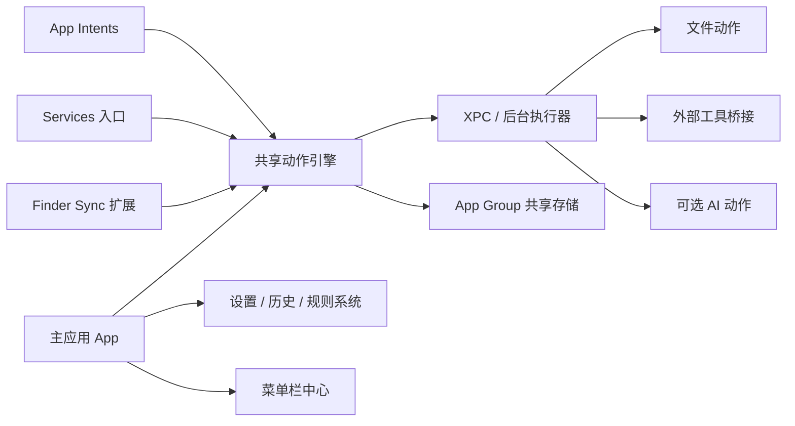

# Super RClick 中文规划

> **For Claude:** REQUIRED SUB-SKILL: Use superpowers:executing-plans to implement this plan task-by-task.

**目标：** 做一个面向 `macOS 26+` 的原生右键助手，让用户在 Finder、选中文本、菜单栏、快捷指令等系统允许的入口里，获得接近 Windows 风格的高效率右键体验。

**架构：** 采用 `SwiftUI + AppKit` 混合架构，以 `Finder Sync + Services + MenuBarExtra + App Intents` 作为主入口，避免走不稳定的全局菜单注入路线。扩展层尽量保持轻量，耗时操作放到 `XPC/后台任务执行层`，所有入口共享同一套动作引擎和规则系统。

**技术栈：** Swift 6、SwiftUI、AppKit、Finder Sync、Services、App Intents、MenuBarExtra、NSXPCConnection、App Group 共享存储、SQLite/Core Data、Swift Testing/XCTest。

---

## 0. 现状补充（2026-03-30 晚）

规划已经往前落了一步，当前产品方向补充如下：

- 首次打开不再依赖一个“去系统设置开启”的孤立提示卡，而是改成页面式的 `启动中心`。
- `启动中心` 既承担首次引导，也承担后续配置中心角色，统一处理：
  - Finder 扩展是否已真正可用
  - 菜单覆盖哪些目录
  - 右键菜单显示哪些动作
  - 桌面背景增强为什么是独立能力，以及后续需要哪些权限
- `动作库` 不再把引导卡片塞在最前面，避免用户一进来就看到“没用的入口”。
- 设置页里保留的是“打开启动中心”的管理入口，不再把启动流程伪装成单独功能。

这意味着当前规划已经从“做一个提示用户去开扩展的工具”升级为“做一个可以自定义、可检查、可回访的启动与配置系统”。

## 1. 规划结论

我用 `brainstorming`、`architecture-designer`、`writing-plans` 三个 skill 重新过了一遍方案，结论是：

- 这个产品最值得做，而且最适合做成 `原生 macOS 工具`。
- 第一阶段不应该承诺“接管所有 App 的右键菜单”，而应该围绕 `Apple 允许的系统入口` 做出“体感接近系统级”的产品。
- 最优启动路径不是“先做 AI”，也不是“先做全局增强”，而是 `先做 Finder 文件场景`。
- 要把它做成长期产品，核心不是某一个菜单，而是 `动作引擎 + 可见性规则 + 多入口复用能力`。

一句话版建议：

`先做 Finder-first 的系统邻接型右键助手，跑通动作引擎和多入口架构，再扩展到文本服务、自动化和高级增强。`

## 2. 产品目标

### 产品定位

`Super RClick` 是一个原生的 macOS 右键效率平台，不只是菜单增强器。

它的目标不是简单多塞几个菜单项，而是：

- 让文件和文件夹操作更像 Windows 一样直接高效
- 让文本和内容处理能通过系统级入口快速调用
- 让用户可以逐步定制自己的上下文动作系统
- 把常见操作、批处理和自动化收敛到同一套产品框架里

### 目标用户

- 经常管理文件、项目目录、素材库的开发者和重度办公用户
- 需要批量重命名、快速复制路径、终端打开、格式转换的人
- 想把零散的小工具收敛到一个统一入口的效率型用户

## 3. 三种路线比较

`brainstorming` 这一步最重要的产出不是功能列表，而是路线选择。

### 方案 A：Finder-first 多入口架构

定义：
- 先围绕 Finder 右键做 MVP
- 同时预留 Services、菜单栏和 App Intents 入口
- 所有入口都走统一动作引擎

优点：
- 最接近“Windows 式右键”的用户心智
- 功能价值最容易被理解
- 技术风险最低
- 可测试性强
- 后续扩展空间大

缺点：
- 不能马上覆盖所有 App 的所有右键场景
- Finder Sync 有作用域限制，需要设计清楚“在哪些目录生效”

### 方案 B：Accessibility-first 全局增强器

定义：
- 以辅助功能和输入监控为核心，尽量覆盖跨 App 的右键增强

优点：
- 表面上“更像全局右键助手”
- 对用户宣传时更容易形成“系统级”的感觉

缺点：
- 权限重
- 稳定性差
- 兼容性风险大
- 维护成本高
- 更容易踩审核、系统升级、行为不可控的问题

### 方案 C：菜单栏中心 + 命令面板优先

定义：
- 先做一个强大的菜单栏工具和动作中心，再逐步接入 Finder/Services

优点：
- 上手快
- 技术实现简单一些
- UI 更容易打磨

缺点：
- “右键助手”的产品感不够强
- 第一印象不够直击痛点
- 与用户期待的“像 Windows 一样的右键”不完全重合

### 推荐结论

推荐选择 `方案 A：Finder-first 多入口架构`。

原因很简单：
- 它最像你想做的东西
- 它最容易先做出强体验
- 它最不容易被平台规则卡死
- 它天然适合以后继续扩成“全功能平台”

## 4. 平台边界与现实约束

这是整份规划里最重要的一段。

### 可以明确做的

- Finder 中的文件和文件夹右键增强
- 选中文本或选中文件后的 Services 能力
- 菜单栏常驻控制中心
- Shortcuts / Spotlight / Siri 系统动作暴露
- 后台任务、批处理、历史记录、工作流规则

### 不应该在 V1 承诺的

- 全局替换所有 App 的右键菜单
- 对任意第三方 App 做稳定的菜单注入
- 在没有权限提示和兼容性验证的情况下做跨应用劫持

### 为什么这么定

根据 Apple 官方文档：

- `Finder Sync` 适合做 Finder 里的目录观察、菜单项、徽章等能力，但它天然是扩展，不适合在扩展进程里堆重活。
- `MenuBarExtra` 适合做“即使 App 不活跃也可用”的常驻控制入口。
- `App Intents` 适合把动作暴露给系统级体验，例如 Shortcuts 和 Spotlight。
- `NSServices` 适合声明应用提供给其他 App 使用的内容处理能力。

所以正确的产品策略不是“对抗系统”，而是“拼装系统允许的入口，做出一个统一产品体验”。

## 5. 产品设计原则

### 原则 1：菜单时间必须快

右键菜单是瞬时场景，菜单生成和可点击反馈必须快。用户不会接受一个右键菜单转圈两秒。

### 原则 2：动作优先于界面

真正构成壁垒的不是设置页，而是动作定义、上下文识别、规则系统、执行稳定性。

### 原则 3：先本地动作，后网络动作

V1 先把本地高频动作做扎实。AI 能力可以加，但绝不能拖慢基础体验。

### 原则 4：多入口共享同一套核心能力

Finder 调起一个动作，菜单栏调起一个动作，Shortcuts 调起一个动作，本质上都应进入同一套执行模型。

### 原则 5：借鉴别人的能力结构，不照搬别人的皮肤

可以借鉴 Windows 资源管理器、PowerToys 类工具、效率工具的动作结构和信息架构，但 UI 仍然要长成真正的 macOS 原生软件。

## 6. V1 范围

### V1 核心定位

`面向 Finder 的原生右键增强器`

### V1 必做功能

- 文件 / 文件夹右键菜单
- 多选支持
- 批量重命名
- 复制完整路径
- 复制 shell 转义路径
- 在当前目录打开 Terminal
- 在当前目录打开 iTerm
- 压缩 / 解压
- 图片快速转换
- PDF 动作挂钩
- 最近使用动作
- 收藏动作
- 菜单可见性规则
- 设置页

### V1 明确不做

- 通用插件市场
- 复杂团队协作
- 远程同步
- 重度 AI 编排
- 跨 App 全局菜单劫持

## 7. V1.5 与 V2

### V1.5

- Services 文本处理
- 文本清洗
- 翻译
- 总结
- 搜索
- 转 Markdown
- 历史与重试

### V2

- 自定义动作配方
- 条件显示规则
- Shortcuts 深度集成
- App Intents 完整接入
- 后台任务队列
- 可选 AI 动作

### V3

- 高级跨应用增强
- 更智能的上下文推荐
- 插件化扩展模型

## 8. 高层架构



### 模块职责

#### 主应用

- 首次引导
- 设置
- 菜单配置
- 规则管理
- 历史与收藏
- 权限说明
- 长任务进度展示

#### Finder Sync 扩展

- 读取当前选中文件上下文
- 快速构造菜单
- 不做重任务
- 把真正执行转交给共享引擎或 XPC

#### Services 层

- 接收文本或文件输入
- 检查输入类型
- 执行动作
- 返回结果或发起后续流程

#### 菜单栏层

- 提供控制中心
- 最近动作
- 快捷入口
- 任务状态
- 错误回看

#### 后台执行层

- 负责耗时任务
- 负责队列、取消、重试
- 避免扩展进程负担过重

## 9. 非功能需求

这是 `architecture-designer` 视角下最应该补强的部分。

### 性能

- 菜单生成：主观感知低于 `100ms`
- 动作分发确认：低于 `150ms`
- 主应用冷启动：低于 `2s`
- 长任务超过 `400ms` 必须有反馈

### 稳定性

- 扩展层崩溃不能拖垮主应用
- 长任务失败必须可重试
- 任务记录必须可追踪

### 可维护性

- 扩展层保持薄
- 业务逻辑尽量在共享模块
- 每个动作必须可单测
- 规则系统要支持以后扩展

### 安全与权限

- 默认最小权限
- 高风险能力放后期
- 所有权限请求都要配解释文案

### 可观测性

- 菜单构建耗时
- 动作执行耗时
- 扩展失败率
- 后台任务失败原因

## 10. 四个关键架构决策

这里用 `ADR` 风格把关键决策定下来。

### ADR-001：采用 Finder-first 多入口架构

**状态：** 建议接受

**背景：**
用户想要的是“像 Windows 一样的右键体验”，但 macOS 没有开放全局右键接管能力。

**决策：**
先以 Finder 右键为 MVP，后续接入 Services、菜单栏和 App Intents。

**正面影响：**
- 用户价值清晰
- 风险较低
- 扩展空间大

**负面影响：**
- 首发覆盖面不是全局

### ADR-002：扩展层只负责接入，不负责重任务

**状态：** 建议接受

**背景：**
Finder Sync 等扩展生命周期特殊，进程不稳定，Apple 也建议把重任务放到独立服务。

**决策：**
扩展只做上下文收集与动作分发，耗时任务统一走 XPC/后台执行层。

**正面影响：**
- 更稳定
- 更容易调试
- 更容易扩展

**负面影响：**
- 架构复杂度略增

### ADR-003：先走 Developer ID 直发，不先卡死 App Store

**状态：** 建议接受

**背景：**
这类系统邻接型工具通常需要更灵活的权限和辅助进程布局。

**决策：**
先以 `Developer ID + notarization` 为主分发方式。

**正面影响：**
- 迭代自由度高
- 不被过早的商店限制绑死

**负面影响：**
- 初期分发和升级体验要自己打磨

### ADR-004：所有入口共享同一套动作引擎和规则系统

**状态：** 建议接受

**背景：**
如果 Finder、Services、菜单栏各写一套逻辑，产品会很快失控。

**决策：**
统一动作定义、统一上下文结构、统一执行记录、统一可见性规则。

**正面影响：**
- 一次开发，多处复用
- 易于测试
- 易于扩展到 App Intents 和自动化

**负面影响：**
- 前期抽象要求更高

## 11. 推荐的代码组织

```text
Super RClick/
├── App/
│   ├── SuperRClickApp.swift
│   ├── Bootstrap/
│   ├── Features/
│   ├── MenuBar/
│   └── Settings/
├── Extensions/
│   ├── FinderSync/
│   ├── Services/
│   └── AppIntents/
├── Shared/
│   ├── Actions/
│   ├── Models/
│   ├── Rules/
│   ├── Persistence/
│   ├── IPC/
│   └── Utilities/
├── Support/
│   ├── Assets/
│   ├── Localizations/
│   └── Build/
├── Tests/
│   ├── Unit/
│   ├── Integration/
│   └── UI/
└── docs/
    └── plans/
```

## 12. 路线图

### Phase 0：可行性骨架

- 建工程
- 建主应用
- 建菜单栏
- 建 Finder Sync 目标
- 建共享存储
- 建动作引擎 stub

### Phase 1：Finder MVP

- 右键菜单出现
- 选择上下文正确
- 五个本地动作可用
- 设置页控制可见性
- 历史可回看

### Phase 1.5：文本与内容能力

- Services 可用
- 中英文本地化
- 最近动作复用

### Phase 2：自动化层

- 规则引擎
- App Intents
- 快捷指令
- 动作配方

### Phase 3：高级增强层

- AI 动作
- 权限更高的跨应用增强
- 智能推荐

## 13. 第一阶段工程实施清单

`writing-plans` 的要求是把可执行的工程入口讲清楚，所以第一阶段我建议按下面顺序开工。

### 任务 1：建工程骨架

**文件：**
- Create: `App/SuperRClickApp.swift`
- Create: `App/Bootstrap/AppCoordinator.swift`
- Create: `Support/Build/xcconfig/Shared.xcconfig`
- Create: `Tests/Unit/AppBootstrapTests.swift`

**目标：**
- 主应用能启动
- 菜单栏入口成形

### 任务 2：建共享动作引擎

**文件：**
- Create: `Shared/Actions/ActionDefinition.swift`
- Create: `Shared/Actions/ActionEngine.swift`
- Create: `Shared/Actions/ActionContext.swift`
- Create: `Shared/Actions/BuiltInActionCatalog.swift`
- Create: `Tests/Unit/ActionEngineTests.swift`

**目标：**
- 所有入口都能走同一套动作调度

### 任务 3：建共享存储

**文件：**
- Create: `Shared/Persistence/AppGroupContainer.swift`
- Create: `Shared/Persistence/PersistenceController.swift`
- Create: `Shared/Models/VisibilityRule.swift`
- Create: `Shared/Models/ActionInvocation.swift`
- Create: `Tests/Unit/PersistenceControllerTests.swift`

**目标：**
- 规则、历史、收藏可持久化

### 任务 4：建 Finder Sync 入口

**文件：**
- Create: `Extensions/FinderSync/FinderSync.swift`
- Create: `Extensions/FinderSync/FinderContextBuilder.swift`
- Create: `Extensions/FinderSync/FinderMenuComposer.swift`
- Create: `Tests/Integration/FinderContextBuilderTests.swift`

**目标：**
- Finder 里能看到基于上下文生成的菜单

### 任务 5：先做五个高频动作

**文件：**
- Create: `Shared/Actions/File/CopyPathAction.swift`
- Create: `Shared/Actions/File/OpenTerminalHereAction.swift`
- Create: `Shared/Actions/File/CompressAction.swift`
- Create: `Shared/Actions/File/BatchRenameAction.swift`
- Create: `Shared/Actions/File/ImageConvertAction.swift`
- Create: `Tests/Unit/FileActionTests.swift`

**目标：**
- 先把真实用户会立即使用的高频动作做扎实

## 14. 风险判断

### 最大风险不是技术，而是预期管理

如果用户以为这是“全局替换所有右键菜单”的工具，预期一定会错位。

所以产品文案和引导必须从第一天就说清楚：

- 它是 `系统邻接型右键助手`
- 它首先强化 Finder、Services、菜单栏和系统动作
- 高级跨应用能力是后续增强，不是首发承诺

### 第二大风险是菜单膨胀

如果什么都想塞，产品会立刻变得难用。

所以需要：

- 智能默认菜单
- 收藏与最近使用
- 按文件类型显示
- 按目录显示
- “更多动作”分组

## 15. 最终建议

如果今天就决定立项，我的建议是：

1. 立项目标就写 `Finder-first 的原生右键效率平台`
2. 首版只做 Finder 文件场景，不做全局接管承诺
3. 从第一天就把 `动作引擎 + 规则系统 + 多入口复用` 当成核心资产
4. 先做五个一用就上瘾的文件动作，而不是一开始铺太大
5. 用直发方式先跑通产品，再决定是否追求 App Store 兼容

## 16. 官方参考链接

- Finder Sync: `https://developer.apple.com/documentation/findersync`
- Finder Sync Programming Guide: `https://developer.apple.com/library/archive/documentation/General/Conceptual/ExtensibilityPG/Finder.html`
- MenuBarExtra: `https://developer.apple.com/documentation/swiftui/menubarextra`
- App Intents: `https://developer.apple.com/documentation/appintents`
- NSServices / Cocoa Keys: `https://developer.apple.com/library/archive/documentation/General/Reference/InfoPlistKeyReference/Articles/CocoaKeys.html`
